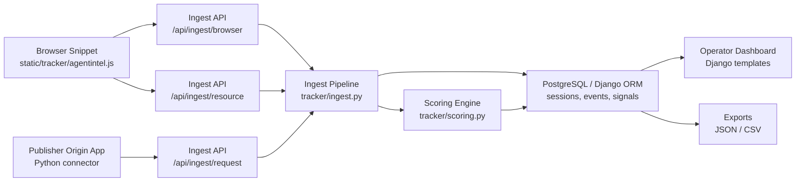

# AgentWatch

AgentWatch is a Django-based traffic intelligence platform for identifying likely AI agents and automated visitors, tracing how they reached a website, reconstructing what they accessed, and explaining why a session looks suspicious.

This repository contains the first MVP: a single-tenant operator dashboard, ingest APIs, a browser snippet, a Python origin connector, passive scoring logic, and Docker packaging for local development and single-server deployment.

## Product overview

AgentWatch is designed for sites that want visibility into:
- which likely AI agents or automated clients are visiting
- how they arrived
- what pages, files, and assets they requested
- whether the session looks human, self-identifying AI traffic, or suspicious automation

The MVP is intentionally analytics-first:
- no CAPTCHA
- no active blocking
- no rate limiting
- no claim that it can prove what a client learned or stored after receiving a response

In AgentWatch, `content accessed` means `requested from your site and served by your infrastructure`.

## Core capabilities

- Browser-side telemetry collection with a lightweight JavaScript snippet
- Origin-side request reporting with a Python connector
- Session correlation across browser and origin events when a session id is available
- Passive scoring for:
  - `human`
  - `known_ai_crawler`
  - `suspected_ai_agent`
  - `generic_automation`
  - `unknown`
- Operator dashboard for:
  - overview metrics
  - session filtering
  - session investigation
  - content-access summaries
  - JSON and CSV exports
- Admin bootstrap and retention/rescoring management commands

## System architecture



## High-level data flow

1. A browser loads the AgentWatch snippet and creates a first-party pseudonymous session id.
2. The snippet reports page views, SPA navigation, browser capability hints, resource observations, and download clicks.
3. The protected site can also report server-side request events through the Python connector.
4. The ingest layer normalizes the payload, builds a visitor fingerprint, updates or creates a session, stores request/resource events, and recalculates the session score.
5. The scoring engine records weighted signals and writes an explanation for the current session classification.
6. Operators inspect the traffic from the dashboard.

## Repository structure

```text
config/                   Django project settings and URL config
connectors/               Publisher-side Python connector
static/tracker/           Browser snippet and dashboard styling
templates/                Login, dashboard, session list, and session detail templates
tracker/                  Models, ingest pipeline, scoring, views, admin, tests
test-site/                Simple local site for manual browser testing
Dockerfile                App container build
docker-compose.yml        Local stack with app + PostgreSQL
entrypoint.sh             Startup script for migrate/bootstrap/static collection
```

## Main components

### 1. Django application

The Django app provides:
- dashboard UI
- login/logout
- ingest endpoints
- ORM models
- admin interface
- export endpoints

Relevant files:
- [config/settings.py](/Users/bishalmahatchhetri/Developer/Personal/Personal%20Project%20/AI-Recaptcha/config/settings.py)
- [tracker/views.py](/Users/bishalmahatchhetri/Developer/Personal/Personal%20Project%20/AI-Recaptcha/tracker/views.py)
- [tracker/models.py](/Users/bishalmahatchhetri/Developer/Personal/Personal%20Project%20/AI-Recaptcha/tracker/models.py)

### 2. Ingest pipeline

The ingest layer:
- validates the site token
- extracts request context
- creates or updates `VisitorIdentity`
- creates or updates `Session`
- stores `RequestEvent` and `ResourceAccessEvent`
- recalculates detection signals and risk scores

Relevant file:
- [tracker/ingest.py](/Users/bishalmahatchhetri/Developer/Personal/Personal%20Project%20/AI-Recaptcha/tracker/ingest.py)

### 3. Scoring engine

The scoring engine currently uses passive signals only:
- self-identifying AI crawler user agents
- headless and automation hints
- cloud-provider clues
- missing browser capability signals
- abnormal request velocity
- direct document access without normal browsing
- crawl-like sequential traversal

Relevant file:
- [tracker/scoring.py](/Users/bishalmahatchhetri/Developer/Personal/Personal%20Project%20/AI-Recaptcha/tracker/scoring.py)

### 4. Browser snippet

The snippet:
- creates a stable local session id
- sends browser page-view events
- detects SPA navigation
- captures capability hints like `navigator.webdriver`
- observes browser resource timing
- reports download clicks

Relevant file:
- [static/tracker/agentintel.js](/Users/bishalmahatchhetri/Developer/Personal/Personal%20Project%20/AI-Recaptcha/static/tracker/agentintel.js)

### 5. Publisher connector

The Python connector is the authoritative path for:
- crawler and no-JS traffic
- real response bytes
- actual content types
- file/document requests served by the site

Relevant file:
- [connectors/publisher_connector.py](/Users/bishalmahatchhetri/Developer/Personal/Personal%20Project%20/AI-Recaptcha/connectors/publisher_connector.py)

## Data model

The MVP stores these core entities:

- `VisitorIdentity`
  - pseudonymous identity based on hashed IP and fingerprint material
- `Session`
  - tracked journey with classification, confidence, score, and explanation
- `RequestEvent`
  - normalized origin or browser request-like event
- `ResourceAccessEvent`
  - page, asset, file, or resource access event
- `DetectionSignal`
  - weighted reason contributing to a session score
- `SessionRiskScore`
  - current score snapshot for the session

## Ingest endpoints

### `POST /api/ingest/browser`

Used by the browser snippet to send page-level activity.

Example payload:

```json
{
  "siteId": "publisher-site",
  "sessionId": "browser-session-1",
  "path": "/pricing",
  "referrer": "https://google.com/search?q=agentwatch",
  "userAgent": "Mozilla/5.0",
  "browserCapabilities": {
    "webdriver": false,
    "languages": ["en-US", "en"]
  },
  "headers": {
    "accept": "text/html"
  }
}
```

### `POST /api/ingest/request`

Used by the origin connector for authoritative request/response reporting.

Example payload:

```json
{
  "siteId": "publisher-site",
  "sessionId": "origin-session-1",
  "path": "/docs/report.pdf",
  "contentType": "application/pdf",
  "responseBytes": 2048,
  "statusCode": 200,
  "method": "GET",
  "userAgent": "Mozilla/5.0 GPTBot/1.0",
  "headers": {
    "accept": "text/html"
  }
}
```

### `POST /api/ingest/resource`

Used by the browser snippet for resource observations and download click events.

All ingest endpoints require:

```http
X-Site-Token: <TRACKER_INGEST_TOKEN>
```

## Quick start with Docker

### 1. Create the environment file

```bash
cp .env.example .env
```

Edit `.env` and replace the default secrets before using the app seriously.

### 2. Start the stack

```bash
docker compose up --build
```

### 3. Open the app

Use:
- [http://127.0.0.1:8000/accounts/login/](http://127.0.0.1:8000/accounts/login/)
- or [http://localhost:8000/accounts/login/](http://localhost:8000/accounts/login/)

If `localhost` does not work on your machine, prefer `127.0.0.1`.

### 4. Sign in

Use the values from:
- `TRACKER_BOOTSTRAP_ADMIN_EMAIL`
- `TRACKER_BOOTSTRAP_ADMIN_PASSWORD`

The Docker entrypoint automatically:
- runs migrations
- bootstraps the first admin user
- collects static files

## Local development without Docker

If you want to run the app directly:

```bash
python3 -m venv .venv
source .venv/bin/activate
pip install -r requirements.txt

export DJANGO_SECRET_KEY=dev-secret
export TRACKER_INGEST_TOKEN=change-me
export TRACKER_BOOTSTRAP_ADMIN_EMAIL=admin@example.com
export TRACKER_BOOTSTRAP_ADMIN_PASSWORD=ChangeMe123!

python3 manage.py migrate
python3 manage.py bootstrap_admin
python3 manage.py runserver
```

If `DATABASE_URL` is not set, Django falls back to SQLite for local development and tests.

## Browser snippet setup

Serve the snippet from this app:

```html
<script src="http://127.0.0.1:8000/static/tracker/agentintel.js"></script>
<script>
  window.AIAgentTracker.init({
    siteId: "publisher-site",
    collectorUrl: "http://127.0.0.1:8000",
    token: "change-me",
    trackResources: true,
    trackDownloads: true,
    sampleRate: 1.0
  });
</script>
```

## Python origin connector example

```python
from connectors.publisher_connector import PublisherRequestReporter

reporter = PublisherRequestReporter(
    collector_url="http://127.0.0.1:8000",
    site_id="publisher-site",
    token="change-me",
)

reporter.send_request_event(
    path="/docs/report.pdf",
    content_type="application/pdf",
    response_bytes=2048,
    status_code=200,
    method="GET",
    session_id="optional-browser-session-id",
    user_agent="Mozilla/5.0 GPTBot/1.0",
)
```

## Testing the MVP locally

### Automated tests

Run:

```bash
python3 manage.py test
```

### Manual API test

Simulate a crawler session:

```bash
curl -X POST http://127.0.0.1:8000/api/ingest/request \
  -H "Content-Type: application/json" \
  -H "X-Site-Token: change-me" \
  -d '{
    "siteId": "publisher-site",
    "sessionId": "local-ai-test",
    "path": "/docs/report.pdf",
    "contentType": "application/pdf",
    "responseBytes": 2048,
    "statusCode": 200,
    "userAgent": "Mozilla/5.0 GPTBot/1.0",
    "headers": {"accept": "text/html"}
  }'
```

Then inspect the `local-ai-test` session in the dashboard.

### Manual browser test

A local test site is included:
- [test-site/index.html](/Users/bishalmahatchhetri/Developer/Personal/Personal%20Project%20/AI-Recaptcha/test-site/index.html)
- [test-site/sample-report.pdf](/Users/bishalmahatchhetri/Developer/Personal/Personal%20Project%20/AI-Recaptcha/test-site/sample-report.pdf)

Serve it with:

```bash
cd test-site
python3 -m http.server 8081
```

Open [http://127.0.0.1:8081](http://127.0.0.1:8081), then:
- load the page to create a browser session
- click the sample report link to generate a document/download event
- click the SPA navigation button to generate another page-level event

Then return to the dashboard and inspect the new session.

## Management commands

- `python manage.py bootstrap_admin`
- `python manage.py prune_tracking_data`
- `python manage.py rescore_sessions`
- `python manage.py test`

## Environment variables

The main environment variables are:

- `DATABASE_URL`
- `DJANGO_SECRET_KEY`
- `DJANGO_ALLOWED_HOSTS`
- `DJANGO_CSRF_TRUSTED_ORIGINS`
- `TRACKER_SITE_ID`
- `TRACKER_INGEST_TOKEN`
- `TRACKER_BOOTSTRAP_ADMIN_EMAIL`
- `TRACKER_BOOTSTRAP_ADMIN_PASSWORD`
- `TRACKER_BASE_URL`
- `TRACKER_RAW_RETENTION_DAYS`
- `TRACKER_AGGREGATE_RETENTION_DAYS`
- `APP_TIME_ZONE`

See [`.env.example`](/Users/bishalmahatchhetri/Developer/Personal/Personal%20Project%20/AI-Recaptcha/.env.example).

## Known limitations

- Classification is heuristic, not authoritative.
- User-agent strings can be spoofed.
- The system cannot prove what a visitor learned, stored, or trained on after a response.
- IP/ASN/provider enrichment is currently limited to what the ingest payload already contains.
- The MVP is single-tenant and not designed yet for multi-customer SaaS use.
- The dashboard is optimized for investigation, not high-scale analytics or live alerting.

## Roadmap ideas

- richer IP and ASN enrichment
- intent inference like `pricing`, `docs`, `images`, `downloads`, `api data`
- active defenses such as challenges or throttling
- alerts and triage inbox
- multi-tenant accounts and organizations
- stronger bot verification and allow/block policy controls

## Suggested GitHub repository description

`Detect and investigate likely AI-agent traffic, crawler behavior, and content access on your website.`
